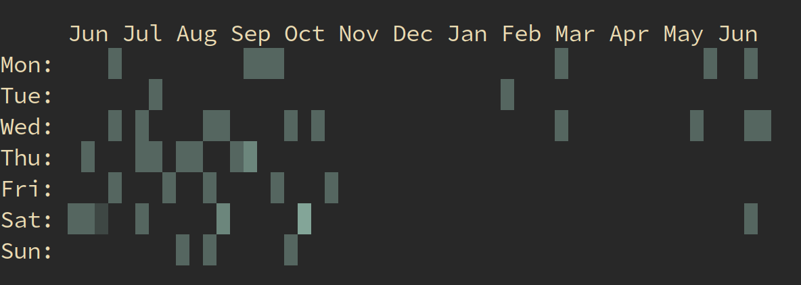

# termgraph.py

A python command-line tool which draws basic graphs in the terminal.

Graph types supported:

- Bar Graphs
- Color charts
- Multi-variable
- Stacked charts
- Horizontal or Vertical
- Emoji!


### Examples

```
termgraph.py data/ex1.dat

# Reading data from data/ex1.dat

2007: ▇▇▇▇▇▇▇▇▇▇▇▇▇▇▇▇▇ 183.32
2008: ▇▇▇▇▇▇▇▇▇▇▇▇▇▇▇▇▇▇▇▇▇▇ 231.23
2009: ▇ 16.43
2010: ▇▇▇▇ 50.21
2011: ▇▇▇▇▇▇▇▇▇▇▇▇▇▇▇▇▇▇▇▇▇▇▇▇▇▇▇▇▇▇▇▇▇▇▇▇▇▇▇▇▇▇▇▇▇▇▇▇▇▇ 508.97
2012: ▇▇▇▇▇▇▇▇▇▇▇▇▇▇▇▇▇▇▇▇ 212.05
2014: ▏ 1.00
```

An example using emoji as custom tick:

```
termgraph.py data/ex1.dat --custom-tick "🏃" --width 20 --title "Running Data"

# Running Data

2007: 🏃🏃🏃🏃🏃🏃🏃 183.32
2008: 🏃🏃🏃🏃🏃🏃🏃🏃🏃 231.23
2009:  16.43
2010: 🏃 50.21
2011: 🏃🏃🏃🏃🏃🏃🏃🏃🏃🏃🏃🏃🏃🏃🏃🏃🏃🏃🏃🏃 508.97
2012: 🏃🏃🏃🏃🏃🏃🏃🏃 212.05
2014:  1.00

```


An example using stdin and emoji:

```
echo "Label,3,9,1" | termgraph.py --custom-tick "😀" --no-title --no-label


😀😀😀 3.00
😀😀😀😀😀😀😀😀😀 9.00
😀 1.00

```

Most results can be copied and pasted wherever you like, since they use standard block characters. However the color charts will not show, since they use terminal escape codes for color. A couple images to show color examples:

```
termgraph.py data/ex4.dat --color {blue,red} --no-title
```


```
termgraph.py data/ex7.dat --color {yellow,magenta} --stacked --title "Stacked Data"
```


Calendar Heatmap, expects first column to be date in yyyy-mm-dd

```
termgraph.py --calendar --start-dt 2017-07-01 data/cal.dat
```




### Install

* Works best with python3
* pip3 install colorama
* Download script, set executable and put in path

### Usage

* Create data file with two columns either comma or space separated.
  The first column is your labels, the second column is a numeric data

* termgraph.py [datafile]

* Help: termgraph.py -h

```

usage: termgraph.py [-h] [--title TITLE] [--width WIDTH] [--format FORMAT]
                    [--suffix SUFFIX] [--no-labels]
                    [--color [{red,blue,green,magenta,yellow,black,cyan} [{red,blue,green,magenta,yellow,black,cyan} ...]]]
                    [--vertical] [--stacked] [--different-scale] [--calendar]
                    [--start-dt START_DT] [--custom-tick CUSTOM_TICK]
                    [--delim DELIM] [--verbose]
                    [filename]

draw basic graphs on terminal

positional arguments:
  filename              data file name (comma or space separated). Defaults to
                        stdin.

optional arguments:
  -h, --help            show this help message and exit
  --title TITLE         Title of graph
  --width WIDTH         width of graph in characters default:50
  --format FORMAT       format specifier to use.
  --suffix SUFFIX       string to add as a suffix to all data points.
  --no-labels           Do not print the label column
  --color [{red,blue,green,magenta,yellow,black,cyan} [{red,blue,green,magenta,yellow,black,cyan} ...]]
                        Graph bar color( s )
  --vertical            Vertical graph
  --stacked             Stacked bar graph
  --different-scale     Categories have different scales.
  --calendar            Calendar Heatmap chart
  --start-dt START_DT   Start date for Calendar chart
  --custom-tick CUSTOM_TICK
                        Custom tick mark, emoji approved
  --delim DELIM         Custom delimiter, default , or space
  --verbose             Verbose output, helpful for debugging
```


### Background

I wanted a quick way to visualize data stored in a simple text file. I initially created some scripts in R that generated graphs but this was a two step process of creating the graph and then opening the generated graph.

After seeing [command-line sparklines](https://github.com/holman/spark) I figured I could do the same thing using block characters for bar charts.

### Contribute

For feature requests or bug reports, use [Github
Issues](https://github.com/mkaz/termgraph/issues).

Thanks to all the additional
[Contributors](https://github.com/mkaz/termgraph/graphs/contributors).


### License

Copyright 2012-2018 Marcus Kazmierczak

Permission is hereby granted, free of charge, to any person obtaining a copy of this software and associated documentation files (the "Software"), to deal in the Software without restriction, including without limitation the rights to use, copy, modify, merge, publish, distribute, sublicense, and/or sell copies of the Software, and to permit persons to whom the Software is furnished to do so, subject to the following conditions:

The above copyright notice and this permission notice shall be included in all copies or substantial portions of the Software.

THE SOFTWARE IS PROVIDED "AS IS", WITHOUT WARRANTY OF ANY KIND, EXPRESS OR IMPLIED, INCLUDING BUT NOT LIMITED TO THE WARRANTIES OF MERCHANTABILITY, FITNESS FOR A PARTICULAR PURPOSE AND NONINFRINGEMENT. IN NO EVENT SHALL THE AUTHORS OR COPYRIGHT HOLDERS BE LIABLE FOR ANY CLAIM, DAMAGES OR OTHER LIABILITY, WHETHER IN AN ACTION OF CONTRACT, TORT OR OTHERWISE, ARISING FROM, OUT OF OR IN CONNECTION WITH THE SOFTWARE OR THE USE OR OTHER DEALINGS IN THE SOFTWARE.

