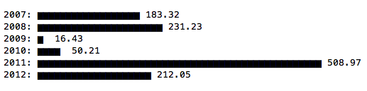

# termgraph.py

A python command-line tool which draws basic graphs in the terminal.

Graph types supported:

- Bar Graphs
- Color charts
- Multi-variable
- Stacked charts
- Horizontal or Vertical

### Examples

`$ python termgraph.py data/ex1.dat`

`$ python termgraph.py data/ex4.dat --color {blue,red} --no-title`

`python3 termgraph.py data/ex7.dat --color {yellow,magenta} --stacked --title "Stacked Data"`

`python3 termgraph.py data/ex1.dat --custom-tick "🏃" --width 20`

### Install

* pip3 install colorama

### Usage

* Create data file with two columns either comma or space separated.
  The first column is your labels, the second column is a numeric data

* python termgraph.py [datafile]

### Background

I wanted a quick way to visualize data stored in a simple text file. I initially created some scripts in R that generated graphs but this was a two step process of creating the graph and then opening the generated graph.

After seeing [command-line sparklines](https://github.com/holman/spark) I figured I could do the same thing using block characters for bar charts.

### Contribute

For feature requests or bug reports, use [Github
Issues](https://github.com/mkaz/termgraph/issues).

Thanks to all the additional
[Contributors](https://github.com/mkaz/termgraph/graphs/contributors).

### License

Copyright 2012-2018 Marcus Kazmierczak

Permission is hereby granted, free of charge, to any person obtaining a copy of this software and associated documentation files (the "Software"), to deal in the Software without restriction, including without limitation the rights to use, copy, modify, merge, publish, distribute, sublicense, and/or sell copies of the Software, and to permit persons to whom the Software is furnished to do so, subject to the following conditions:

The above copyright notice and this permission notice shall be included in all copies or substantial portions of the Software.

THE SOFTWARE IS PROVIDED "AS IS", WITHOUT WARRANTY OF ANY KIND, EXPRESS OR IMPLIED, INCLUDING BUT NOT LIMITED TO THE WARRANTIES OF MERCHANTABILITY, FITNESS FOR A PARTICULAR PURPOSE AND NONINFRINGEMENT. IN NO EVENT SHALL THE AUTHORS OR COPYRIGHT HOLDERS BE LIABLE FOR ANY CLAIM, DAMAGES OR OTHER LIABILITY, WHETHER IN AN ACTION OF CONTRACT, TORT OR OTHERWISE, ARISING FROM, OUT OF OR IN CONNECTION WITH THE SOFTWARE OR THE USE OR OTHER DEALINGS IN THE SOFTWARE.

